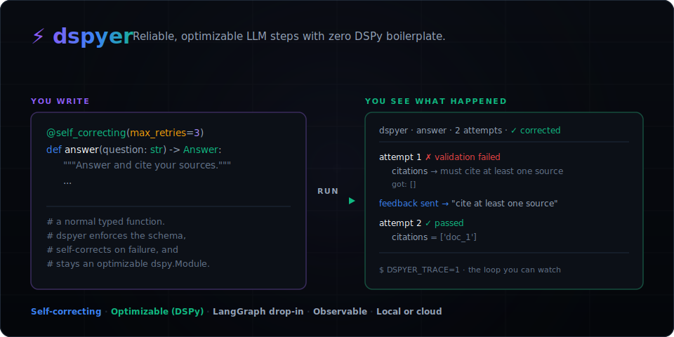

<div align="center">

# ⚡ dspyer

**Reliable, optimizable LLM steps with zero DSPy boilerplate: typed outputs, automatic self-correction, and one-call prompt tuning. Built to drop straight into your existing agent stack.**

[](https://github.com/theramkm/dspyer/actions/workflows/ci.yml)
[](https://github.com/theramkm/dspyer/actions)
[](https://colab.research.google.com/github/theramkm/dspyer/blob/main/notebooks/dspyer_playground.ipynb)

</div>

---



---

## Why dspyer?

If you are building production agents with LangChain, LangGraph, or custom LLM API loops, you face three primary challenges:
1. **Prompt Decay**: When you upgrade models (e.g., from GPT-4o to Claude 3.5 Sonnet), your carefully engineered prompt strings fail. They need manual, tedious re-tuning.
2. **Brittle Validations**: You write verbose `try/except` loops and custom logic to catch malformed JSON and missing fields from the LLM.
3. **No Systematic Tuning**: There is no simple way to optimize prompts programmatically or automatically select the best few-shot exemplars for your specific tasks.

**Stanford DSPy** solves this by treating prompts as *parameters* that can be compiled and optimized against a dataset. However, adopting DSPy directly requires learning a complex new syntax (Signatures, Predictors, Modules) and rewriting your entire codebase.

**dspyer** acts as an ergonomic bridge: it transpiles standard Python functions, Pydantic schemas, and agent graphs into optimized `dspy.Module` instances under the hood, allowing you to drop them straight back into your existing orchestrator.

---

## Core Concept

You write standard, PEP 484 type-hinted Python functions. `dspyer` dynamically compiles them into DSPy signatures, wraps them with schema-validated retry loops, runs them over high-performance connection pools, and exposes them as native `dspy.Module` objects ready for optimization.

---

## Key Benefits

### 1. Standard DSPy Compilation (No Vendor Lock-In)
`dspyer` compiles your code directly into a standard `dspy.Module`. You get access to the entire DSPy optimizer ecosystem (`BootstrapFewShot`, `MIPROv2`, etc.). You can save and load your optimized prompts using standard `dspy.save` and `dspy.load` JSON configs.

### 2. Zero-Config Self-Correction Loops
When an LLM output fails Pydantic schema validation, `dspyer` intercepts the error, auto-generates natural-language feedback detailing the failed fields, and automatically re-queries the model (up to your retry budget) until it conforms. Any Python runtime errors (like `NameError` or `AttributeError`) within custom validator functions fail fast immediately rather than wasting API retry budgets on loops.

### 3. Production Telemetry & Validation Reports
Production-level observability is built-in:
*   **OpenTelemetry**: Trace every retry cycle, failed payload, and validation error as span attributes.
*   **Batch Validation Reports**: Compile validation logs (`validation_log_path`) into structured, human-readable summary reports showing node error rates and failing Pydantic fields.

### 4. Self-Correction Dataset Flywheel
Validation failures that successfully repair themselves are automatically logged via `dataset_log_path`. You can reload these logs using the loader utility to compile high-precision few-shot training datasets containing input-to-corrected-output pairs, creating an automated data loop to optimize subsequent prompt runs.

### 5. High-Performance Runtime (DirectLM)
To prevent runtime overhead, `dspyer` features a built-in `DirectLM` adapter that completely bypasses LiteLLM at runtime. It maintains persistent HTTP connection pools (`httpx` clients with connection keepalive limits) to eliminate setup latency.

---

## Install

> **Pre-release (`0.3.0`)**: Install directly from GitHub:

```bash
pip install git+https://github.com/theramkm/dspyer.git
# or using uv:
uv add git+https://github.com/theramkm/dspyer.git
```

---

## Quickstart: Self-Correction in 30 Seconds (No API Key)

This runs completely offline using a mock model backend. The node contract requires an answer with at least one citation. The mock "forgets" the citation on the first try, fails validation, receives the correction feedback, and successfully repairs itself.

```python
import dspy
from pydantic import BaseModel, Field, field_validator
from dspy_transpiler.graph import Graph, StatefulNode
from dspy_transpiler.compiler import AgentTranspiler, MockCompletionResult

# 1. Describe the schema contract you want the LLM to honor
class Query(BaseModel):
    query: str

class RAGResponse(BaseModel):
    answer: str = Field(description="Answer referencing the sources")
    citations: list[str] = Field(description="Sources cited, e.g. ['doc_1']")

    @field_validator("citations")
    @classmethod
    def must_cite(cls, v):
        if not v:  # Ensure we cite at least one source
            raise ValueError("Answer must cite at least one source.")
        return v

# 2. Define an optimizable, self-correcting node
node = StatefulNode(
    "Synthesizer", Query, RAGResponse,
    instructions="Answer the query and cite sources.",
    max_retries=3,
)
graph = Graph()
graph.add_node(node)
graph.set_entry_point("Synthesizer")
program = AgentTranspiler.compile(graph)

# 3. Offline mock: omits the citation until it sees correction feedback
class MockLM(dspy.LM):
    def __init__(self): super().__init__(model="mock")
    def forward(self, prompt=None, messages=None, **kw):
        saw_feedback = "feedback" in str(prompt or messages)
        good = '{"answer": "Apache-2.0 [doc_1].", "citations": ["doc_1"]}'
        bad  = '{"answer": "Apache-2.0.", "citations": []}'
        return MockCompletionResult(good if saw_feedback else bad, "mock")

dspy.configure(lm=MockLM())
r = program(query="What license is dspyer under?")

print("Answer:   ", r.answer)                                   # Apache-2.0 [doc_1].
print("Citations:", r.citations)                                # ['doc_1']
print("Self-correction loops:", r["_metadata"]["refinement_steps_taken"])  # 1
```

*   **Live Run**: Run `python examples/quickstart.py` to run this against a live provider (OpenAI, Gemini, Ollama, Anthropic).
*   **Offline Example**: Try `python examples/run_rag_verifier.py` to test detailed verification logic.

---

## Core Capabilities

### 1. Zero-Boilerplate Decorator
Wrap any plain typed Python function. The parameters map to inputs, the docstring acts as instructions, and the return annotation defines the schema:

```python
from dspy_transpiler import self_correcting
from pydantic import BaseModel

class SolverOutput(BaseModel):
    answer: str
    steps: list[str]

@self_correcting(max_retries=3)
def solve(question: str) -> SolverOutput:
    """Answer the question and outline the logic steps."""
    pass

# Returns a SolverOutput instance
result = solve(question="What is the capital of France?")
```

You can also decorate standard `dspy.Module` classes to automatically wrap nested predictors:

```python
@self_correcting(schema=SolverOutput, max_retries=3)
class Solver(dspy.Module):
    def __init__(self):
        super().__init__()
        self.solve = dspy.Predict("question -> answer, steps")

    def forward(self, question):
        return self.solve(question=question)
```

### 2. Prompt Optimization (Tune, Save, Load)
Compile your transpiled program, optimize against a dataset using any DSPy teleprompter, and save the serialized config to JSON:

```python
from dspy.teleprompt import BootstrapFewShot

def metric(example, pred, trace=None) -> bool:
    return example.sentiment.lower() == pred.sentiment.lower()

optimizer = BootstrapFewShot(metric=metric, max_bootstrapped_demos=2)
optimized = optimizer.compile(program, trainset=trainset)

# Save prompts
optimized.save_prompts("agent_config.json")

# Load in production
production_program.load_prompts("agent_config.json")
```

On our bundled sentiment benchmark (run against a simulated model backend in [`examples/benchmark.py`](examples/benchmark.py) to demonstrate the prompt optimization loop programmatically), optimization improves accuracy from **60% to 90%** with only the reasoning node tuned.

### 3. Orchestrator Integration (LangGraph)
You do not need to replace your orchestrator. You can compile individual `dspyer` nodes and invoke them inside existing LangGraph nodes:

```python
compiled_agent = AgentTranspiler.compile(graph)

def run_agent_node(state):
    pred = compiled_agent(query=state["user_query"])
    return {"agent_response": pred.answer, "citations": pred.citations}
```

Alternatively, scaffold an entire LangGraph `StateGraph` topology into a `dspyer.Graph` automatically. Non-LLM nodes are preserved as native Python passthroughs:

```python
from dspy_transpiler import from_langgraph

node_mappings = {
    "Clean": StatefulNode("Clean", CleanInput, CleanOutput, instructions="Normalize the query"),
    "Solve": StatefulNode("Solve", SolveInput, SolveOutput, instructions="Answer the query"),
}
graph = from_langgraph(builder, node_mappings=node_mappings)
program = AgentTranspiler.compile(graph)
```

### 4. Telemetry & Validation Reporting
Enable validation logging to capture production failure metadata:

```python
program = AgentTranspiler.compile(graph, validation_log_path="logs/validation.jsonl")
```

Generate a summary report detailing per-node error rates and failing Pydantic fields:

```python
from dspy_transpiler.utils import generate_validation_report

print(generate_validation_report("logs/validation.jsonl"))
```

Example report:
```text
==================================================
           dspyer Batch Validation Report
==================================================

Node: Synthesizer
--------------------------------------------------
  Total Runs: 10
  Successful Runs: 8 (80.0%)
  Failed Runs: 2 (20.0%)
  Retry Rate: 40.0% (4/10 runs required retries)
  Average Retries: 0.80 per run
  Top Failing Pydantic Fields:
    - citations: 4 errors (66.7% of total errors)
    - answer: 2 errors (33.3% of total errors)

==================================================
```

### 5. Self-Correction Dataset Flywheel
Configure `dataset_log_path` on either the `@self_correcting` decorator or during transpilation compilation to capture successful self-correction runs (saving the initial input and the final corrected output):

```python
program = AgentTranspiler.compile(graph, dataset_log_path="logs/flywheel.jsonl")
```

Then, load the logged executions using `load_logged_dataset` to dynamically generate a clean training dataset of `dspy.Example` objects:

```python
from dspy_transpiler.utils import load_logged_dataset

# We must specify which keys act as model inputs
trainset = load_logged_dataset(
    log_path="logs/flywheel.jsonl",
    input_keys=["query"]
)
```

---

## Feature Reference

| Feature | Summary |
|---|---|
| `@self_correcting` | One-line schema-validated retry loop for plain functions or `dspy.Module` classes. |
| `StatefulNode` | Per-node configuration specifying Pydantic schemas, retry budgets, and custom refiners. |
| `use_cot=True` | Injects chain-of-thought rationales dynamically without polluting your output schemas. |
| `ImmutableState.merge()` | Standard merge policies (`last_write_wins`, `combine_lists`, `raise`) to reconcile parallel branches. |
| `from_langgraph()` | Scaffold existing LangGraph topologies, isolating LLM reasoning nodes. |
| `save_prompts` / `load_prompts` | Save and load compiled node instructions to and from JSON. |
| `DirectLM` | High-performance adapter bypassing LiteLLM with persistent HTTP connection pools. |
| Batch Validation Reports | Track schema failure rates and identify struggling nodes and validation fields. |

---

## Project Status

Pre-release (`0.3.0`), actively developed. Green CI across Python 3.10 to 3.14, fully type-checked (`mypy`) and linted (`ruff`), with a 66-case test suite. Issues and PRs are welcome.

## License

[Apache License 2.0](LICENSE).
