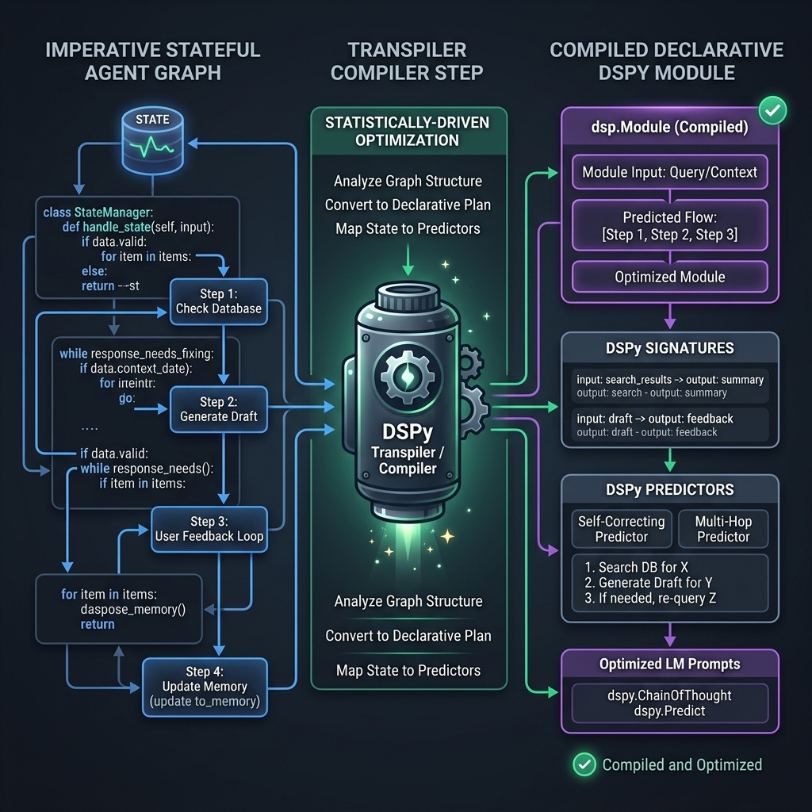

# ⚡ dspyer

> **Transpile stateful, imperative graph topologies into declarative, auto-optimizable DSPy modules.**

[](https://github.com/theramkm/dspyer/actions/workflows/ci.yml)
[](https://github.com/theramkm/dspyer/actions)
[](https://colab.research.google.com/github/theramkm/dspyer/blob/main/notebooks/dspyer_playground.ipynb)

---



## 🎯 What is dspyer?

In modern AI engineering, manual prompt engineering is dead. We use DSPy to statistically optimize prompt weights and instructions. But mapping complex, imperative state machines (with loops, branches, and retries) to DSPy's declarative format has been notoriously difficult.

**`dspyer` solves this.** It parses stateful graphs, handles immutable state transitions, executes validation/self-correction loops, and automatically compiles them into standard `dspy.Module` classes. Your agent workflows are now ready for **few-shot prompt optimization** via DSPy teleprompters.

### 🤝 The LangGraph & PydanticAI Bridge (Our USP)

In 2026, building production-grade agents presents a trade-off:
* **LangGraph**: The industry standard for master orchestration, cyclic state management, state persistence, and human-in-the-loop flows.
* **DSPy**: The industry standard for algorithmic prompt optimization and self-correction, but lacks a simple graph representation.

**`dspyer` allows you to plug DSPy's optimization directly into your existing LangGraph workflows.** Instead of rewriting your entire architecture, you can build or transpile complex reasoning and generation nodes using `dspyer` graphs, and drop the compiled `dspy.Module` directly into your existing LangGraph python functions.

#### 🔌 Drop-In Upgrade: Plugging `dspyer` into an existing LangGraph Node

```python
from pydantic import BaseModel, Field
from dspy_transpiler.graph import Graph, StatefulNode
from dspy_transpiler.compiler import AgentTranspiler

# --- 1. Define and compile the optimizable agent node with dspyer ---
class AgentInput(BaseModel):
    query: str

class AgentOutput(BaseModel):
    answer: str
    citations: list[str]

agent_node = StatefulNode(
    name="Agent",
    input_model=AgentInput,
    output_model=AgentOutput,
    instructions="Answer queries using context citations."
)

graph = Graph()
graph.add_node(agent_node)
graph.set_entry_point("Agent")

# Compile to a standard, optimizable dspy.Module
compiled_agent = AgentTranspiler.compile(graph)


# --- 2. Drop it directly into your existing LangGraph node function ---
from langgraph.graph import StateGraph

class LangGraphState(dict):
    user_query: str
    agent_response: str
    citations: list[str]

# The existing LangGraph node function
def run_agent_node(state: LangGraphState):
    # Call the compiled dspyer module like a standard python function
    prediction = compiled_agent(query=state["user_query"])
    
    # Return updates back to the LangGraph state
    return {
        "agent_response": prediction.answer,
        "citations": prediction.citations
    }

# Build and orchestrate your LangGraph workflow normally
workflow = StateGraph(LangGraphState)
workflow.add_node("agent_node", run_agent_node)
# ... add_edge, set_entry_point, compile ...
```


---

## 🚀 Try It In 10 Seconds (No API Key Required)

Copy-paste this snippet to create a stateful classifier, compile it to a declarative DSPy module, and run it locally using a built-in Mock LM—no credentials or network required.

### 1. Install

```bash
# Add as a dependency to your project:
uv add git+https://github.com/theramkm/dspyer.git

# Or install locally via pip:
pip install git+https://github.com/theramkm/dspyer.git
```

### 2. Run the Zero-Config Quickstart

```python
import dspy
from pydantic import BaseModel, Field
from dspy_transpiler.graph import Graph, StatefulNode
from dspy_transpiler.compiler import AgentTranspiler

# 1. Define input & output schemas
class ExtractionInput(BaseModel):
    raw_text: str = Field(description="The source text to analyze")

class ExtractionOutput(BaseModel):
    user_name: str = Field(description="Name of the user extracted from text")
    rough_query: str = Field(description="User query context")

class ClassificationInput(BaseModel):
    rough_query: str = Field(description="Extracted rough query")

class ClassificationOutput(BaseModel):
    classified_intent: str = Field(description="Category intent: Support, Sales, Info")

# 2. Build graph nodes
node_extraction = StatefulNode(
    name="EntityExtractor",
    input_model=ExtractionInput,
    output_model=ExtractionOutput,
    instructions="Extract the user's name and their query context from raw text."
)

node_classification = StatefulNode(
    name="IntentClassifier",
    input_model=ClassificationInput,
    output_model=ClassificationOutput,
    instructions="Classify the intent of the rough query into: Support, Sales, or Info."
)

# 3. Build graph topology
graph = Graph()
graph.add_node(node_extraction)
graph.add_node(node_classification)
graph.set_entry_point("EntityExtractor")
graph.add_edge("EntityExtractor", "IntentClassifier")

# 4. Transpile graph into a declarative DSPy module
program = AgentTranspiler.compile(graph)

# 5. Create a Mock LM to intercept LLM calls
class QuickstartMockLM(dspy.LM):
    def __init__(self):
        super().__init__(model="mock-quickstart-model")

    def forward(self, prompt=None, messages=None, **kwargs):
        prompt_str = str(prompt or messages)
        if "user_name" in prompt_str:
            content = '{"user_name": "Alice", "rough_query": "buy a subscription"}'
        elif "classified_intent" in prompt_str:
            content = '{"classified_intent": "Sales"}'
        else:
            content = '{}'

        class MockChoiceMessage:
            def __init__(self, content_str):
                self.content = content_str
                self.role = "assistant"
                self.reasoning_content = None

        class MockChoice:
            def __init__(self, content_str):
                self.message = MockChoiceMessage(content_str)
                self.finish_reason = "stop"
                self.index = 0

        class MockResult:
            def __init__(self, content_str):
                self.choices = [MockChoice(content_str)]
                self.model = "mock-quickstart-model"
                self.usage = {"completion_tokens": 0, "prompt_tokens": 0, "total_tokens": 0}

        return MockResult(content)

# 6. Configure DSPy to use the Mock LM and run
dspy.configure(lm=QuickstartMockLM())
result = program(raw_text="Hello, my name is Alice. I would like to buy a subscription.")
print(result)
```

---

## 🍳 Real-World Production Recipes

We avoid toy examples. Look at our production-ready recipes to see the full capabilities of `dspyer`.

### 🛡️ 1. Self-Correction & Verification Loops
A RAG node that queries a simulated source, validates the response, and uses the dynamic validation loop to self-correct if the citation is missing or the response is empty.

To run this recipe locally:
```bash
uv run examples/run_rag_verifier.py
```
*Code reference:* [examples/run_rag_verifier.py](examples/run_rag_verifier.py)

### 🎯 2. DSPy Prompt Optimization Pipeline
A script that runs DSPy's `BootstrapFewShot` teleprompter to optimize the prompts of a transpiled agent program, demonstrating the core value proposition of `dspyer`.

To run this recipe locally:
```bash
uv run examples/optimize_agent_prompt.py
```
*Code reference:* [examples/optimize_agent_prompt.py](examples/optimize_agent_prompt.py)

### 🔀 3. Loops & Concurrent Parallel Branches
Executes complex parallel paths concurrently, splits execution into sentiment analysis and tag extraction, and reconciles state branches using custom merge policies.

To run this recipe locally:
```bash
uv run examples/run_parallel_loop.py
```
*Code reference:* [examples/run_parallel_loop.py](examples/run_parallel_loop.py)

---

## 💎 Elite 2026 Features

### 🔄 1. Dynamic Validation & Self-Correction Loops
If your model output fails Pydantic schema validation, `dspyer` automatically initiates a correction retry loop, generating natural-language feedback describing the validation failure, and prompting the model to repair its response.

### 🔀 2. State Conflict Resolution Merging
Execute parallel paths concurrently, then reconcile diverging dictionaries cleanly using custom merge policies:
```python
# Reconcile diverging state branches (concatenates list elements, resolves other keys)
merged = state_a.merge(state_b, policy="combine_lists")
```

### 🏎️ 3. Direct `DirectLM` Adapter (Bypassing LiteLLM)
> [!NOTE]
> Standard DSPy `dspy.LM` adapters are the default recommended configuration for general use to leverage LiteLLM's full routing, caching, and streaming features.
>
> `DirectLM` (inheriting from `dspy.BaseLM`) is an optimized, high-performance alternative designed to completely bypass LiteLLM's runtime layer, eliminating event loop blocking and thread contention in latency-critical production environments.

Connect directly to Ollama, OpenAI, Anthropic, and Google Gemini using a persistent, pooled connection pool with jittered backoff:
```python
from dspy_transpiler.compiler import DirectLM

lm = DirectLM(model="google/gemini-2.5-flash")
dspy.configure(lm=lm)
```

### 📈 4. Refinement Loss Metric Logging
Each compiled module records the number of self-correction steps and path steps taken, returning this metadata under `_metadata`:
```python
metadata = result["_metadata"]
print(f"Correction retries: {metadata['refinement_steps_taken']}")
print(f"Total steps run: {metadata['step_count']}")
```
*Use this metrics payload as a penalty term in your optimizer loss function to optimize for low latency and high accuracy.*

---

## 🗺️ Mapping Framework Topologies (LangGraph / PydanticAI)

`dspyer` compiles a custom stateful `Graph` architecture. You can easily map your existing workflows from LangGraph or PydanticAI onto `dspyer` using the following patterns:

### 1. LangGraph Nodes to StatefulNodes
In LangGraph, nodes are functions that receive state and return state patches. In `dspyer`, nodes are declared with explicit Pydantic `input_model` and `output_model` boundaries to enable DSPy-level optimizations:

```python
# 1. Declare Pydantic boundary models
class SearchInput(BaseModel):
    query: str

class SearchOutput(BaseModel):
    results: list[str]

# 2. Declare the StatefulNode
search_node = StatefulNode(
    name="WebSearch",
    input_model=SearchInput,
    output_model=SearchOutput,
    instructions="Query search engines to resolve user query details."
)

# 3. Add to Graph
graph.add_node(search_node)
```

### 2. LangGraph Conditional Edges to Router Nodes
In LangGraph, conditional routing functions route based on the state. You can translate this directly into `dspyer` using python callables as routers:

```python
def check_relevance_router(state: dict) -> str:
    if len(state.get("results", [])) > 0:
        return "proceed"
    return "retry"

graph.add_conditional_edges(
    "WebSearch",
    check_relevance_router,
    {"proceed": "SummarizerNode", "retry": "WebSearch"}
)
```

## 📊 Telemetry & Visualization Guide

Visualize agent execution, transpilation flow, and validator loop cycles inside **Arize Phoenix**, **Langfuse**, or **Jaeger** with OpenTelemetry tracing.

> [!NOTE]
> **Trace Sources**: `openinference.instrumentation.dspy.DSPyInstrumentor` instruments and traces the internal DSPy signature/model-level execution spans. `dspyer` emits its own native execution spans separately (under the standard `dspyer` tracer namespace) to trace graph-level step transitions and routing.

```python
from openinference.instrumentation.dspy import DSPyInstrumentor
from opentelemetry import trace
from opentelemetry.sdk.trace import TracerProvider
from opentelemetry.sdk.trace.export import SimpleSpanProcessor
from opentelemetry.exporter.otlp.proto.http.trace_exporter import OTLPSpanExporter

# 1. Configure OpenTelemetry Tracer pointing to your collector (e.g. Phoenix at port 6006)
otlp_exporter = OTLPSpanExporter(endpoint="http://localhost:6006/v1/traces")
tracer_provider = TracerProvider()
tracer_provider.add_span_processor(SimpleSpanProcessor(otlp_exporter))
trace.set_tracer_provider(tracer_provider)

# 2. Instrument DSPy module calls
DSPyInstrumentor().instrument()
```

Launch a local Phoenix server using:
```bash
pip install arize-phoenix openinference-instrumentation-dspy opentelemetry-exporter-otlp
phoenix start
```
Then navigate to `http://localhost:6006/` to explore interactive traces for every step execution, correction loop retry, and model signature inputs/outputs.

---

## 🛡️ License

This project is licensed under the [Apache License 2.0](LICENSE).
